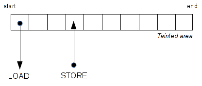
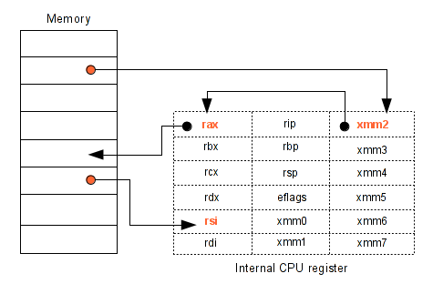
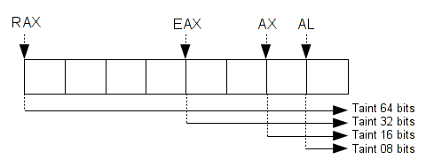

# 使用Pin进行污点分析与模式匹配


**作者：**[Jonathan Salwan](http://twitter.com/JonathanSalwan)
---

上周我在研究Pin的API，这篇文章作为我个人的思考笔记。这篇文章的所有例子都仅仅是个PoC，因此不是100%都可以运行。但是能给人灵感。

## 目录:
* [1 - 介绍](#1-介绍)
  * [1.1 - 概念](#11-概念)
  * [1.2 - 什么是污点](#12-什么是污点)
    * [1.2.1 - 动态分析](#121-动态分析)
    * [1.2.2 - 静态分析](#122-静态分析)
    * [1.2.3 - 动态还是静态?](#123-动态还是静态?)
  * [1.3 - 一些问题](#13-一些问题)
    * [1.3.1 - 字节还是比特?](#131-字节还是比特?)
* [2 - 简单的污染内存块](#2-简单的污染内存块)
  * [2.1 - 捕获系统调用](#21-捕获系统调用)
  * [2.2 - 捕获LOAD和STORE指令](#22-捕获LOAD和STORE指令)
  * [2.3 - 输出](#23-输出)
* [3 - 传播污点](#3-传播污点)
  * [3.1 - 需求](#31-需求)
  * [3.2 - 内存传播](#32-内存传播)
  * [3.3 - 寄存器传播](#33-寄存器传播)
  * [3.4 - 输出](#34-输出)
* [4 - 跟随你的数据](#4-跟随你的数据)
  * [4.1 - 需求](#41-需求)
  * [4.2 - 输出](#42-输出)
* [5 - 检测UAF漏洞](#5-检测UAF漏洞)
  * [5.1 - 通过废弃的栈帧](#51-通过废弃的栈帧)
  * [5.2 - 经典的UAF](#52-经典的UAF)
    * [5.2.1 - ]()
    * [5.2.2 - ]()
    * [5.2.3 - ]()
    * [5.2.4 - ]()
* [6 - 检测未检查指针的使用](#6-检测未检查指针的使用)
  * [6.1 - ]()
  * [6.2 - 输出](#62-输出)
* [7 - 总结](#7-总结)
  * [7.1 - 使用Pin进行污点分析和模式匹配](#71-使用Pin进行污点分析和模式匹配)
  * [7.2 - 引用](#72-引用)
    * [7.2.1 - Web引用](#721-Web引用)
    * [7.2.2 - 本文示例代码](#722-本文示例代码)
  * [7.3 - 致谢](#73-致谢)


# 1-介绍
## 1.1-概念
污点分析是一种流行的方法，其包含了检查用户输入的变量哪些被修改过。所有用户输入如果没有经过正确的检查，都是危险的。使用污点分析方法去检查寄存器和内存区域哪些被用户控制了当程序崩溃时 - 这可能是有用的。


要知道一个区域是可读还是可写这是非常容易的。但是要去检查哪些区域是用户可控的和哪些区域被污点传播过了，这是非常困难的。比如，看下面代码:

```c
/* Example 1 */
void foo1(const char *av[])
{
  uint32_t a, b;

  a = atoi(av[1]);
  b = a;
  foo2(b);
}

/* Example 2 */
void foo2(const char *av[])
{
  uint8_t *buffer;

  if (!(buffer = (uint8_t *)malloc(32 * sizeof(uint8_t))))
    return(-ENOMEM);

  buffer[2]  = av[1][4];
  buffer[12] = av[1][8];
  buffer[30] = av[1][12];
}
```

在第一个例子中，一开始变量`a`和`b`并不是污点。当`atoi`函数被调用时，变量`a`被污染了。然后当变量`b`被分配了变量`a`的值后也被污染了。现在我们能知道`foo2`函数的两个参数都是用户可控的。

在第二个例子中，当`buffer`被`malloc`函数分配内存时并不是污点。之后，当被分配的区域被用户输入初始化时，我们需要污染`buffer+2`, `buffer+12`, `buffer+30`这3个字节。之后，当其中一个，两个或者所有字节被读时，我们可以得知读取这些字节的地方是用户可控的。

## 1.2-什么是污点
我们有两种可使用的方式，静态或动态分析。从这两种方式，我们能找到一些他们的优点和缺点。

### 1.2.1-动态分析
使用动态分析，基本上我们需要确定所有的用户输入，比如环境变量和系统调用。当我们遇到这些指令时，比如GET/PUT, LOAD/STORE，我们开始污染这些输入和传播或移除污点。


为了进行动态分析，我们需要一个动态二进制插桩框架(简称DBI)。DBI的目的是在每个指令间增加pre/post句柄。当一个句柄被调用时，你能够获取到所有你想知道的关于指令或环境(内存)的所有信息。

有一些工具提供一个叫中介码(IR)的数据结构。例如，[Valgrind](http://valgrind.org/)是一个受欢迎使用IR(Vex)的插桩框架。通常使用IR，每个变量都是处于静态单赋值形式([Static Single Assignment Form](http://en.wikipedia.org/wiki/Static_single_assignment_form))，这能更简单去标记污点和管理你的内存。下面有一个例子，是关于VEX和SSA form的，下面的代码是Vex用来代替`add eax, ebx`指令的替代表示。

```
t3 = GET:I32(0)     # get %eax, a 32-bit integer (t3 = eax)
t2 = GET:I32(12)    # get %ebx, a 32-bit integer (t2 = ebx) 
t1 = Add32(t3,t2)   # eger (t2 = ebx)
PUT(0) = t1         put %eax (eax = t1)
```

我选择使用[Pin](http://software.intel.com/en-us/articles/pin-a-dynamic-binary-instrumentation-tool)： 一个由Intel用C++开发的动态二进制插桩框架(不使用IR)。

### 1.2.2-静态分析
使用静态分析的优点是事实上，静态分析能比动态分析更好的覆盖代码。比如你下面看到的这例子，当代码被解析时，我们能提供一个上下文无关语法(CFG)和检测所有分支。


从另一方面来看，静态分析的主要缺点是它没动态分析准确 - 比如静态分析不能得到运行时的信息。我们不能获取到寄存器或内存的值。

### 1.2.3-动态还是静态?
正如你所看到的，每种方法都有各自的优缺点。如果你使用动态分析，我们就不能覆盖到所有的代码，但是结果是更可靠的。如果你使用静态分析，能覆盖到所有代码，但是却不能得到运行时的上下文信息。我选择使用动态分析，并讨论Pin的用法。也许在未来的博文中，我会提及到更多的静态分析 -- 静态分析是一种非常有趣的方法，并且我们能基于AST(Abstract Syntax Tree，抽象语法树)做许多非常棒的事。

## 1.3-一些问题
在研究动态分析时，我遇到了一些问题。我认为在进行污点分析时我们会发现许多有趣的问题。

### 1.3.1-字节还是比特?
其中一个问题是要确定什么方法能更准确的做一个大精度的污点标记。例如，当一个被控制的字节被乘并被储存到内存的某个地方，我们应该做什么？我们应该标记目标变量吗？看下面的代码:

```
; uint32_t num, x;
;
; x = atoi(av[1])
; if (x > 0 && x < 4)
;   num = 7 * x;
; return num;

400556:   call   400440 <atoi@plt>
40055b:   mov    edx,eax
40055d:   mov    eax,edx
40055f:   shl    eax,0x3
400562:   sub    eax,edx
400564:   mov    DWORD PTR [rbp-0x4],eax
400567:   mov    eax,DWORD PTR [rbp-0x4]
40056a:   leave  
40056b:   ret
```

在上面的代码中，我们仅仅只能控制变量`num`的5比特，而不是整个整型数据。所以，当这变量作为返回值返回时或在其他地方被使用时，我们不能说我们控制了这个变量的整体。


那么，该怎么办呢？是标记字节更容易，还是标记用户控制的比特更容易呢？如果你标记字节，这会更容易，但是数据不会100%可靠。如果我们标记字节，将会更困难，还有许多管理污点树的难点，但是这得到的数据是99%可靠的。这只是我们不得不解决的问题之一。

# 2-简单的污染内存块
在第一个例子中，我们将要染色`read`内存区域，然后我们将会看到Pin的API简要的概况。在第一个测试中，我们将会:
1. 捕获`sys_read`的系统调用
2. 获得污点区域的第二和第三个参数
3. 当有像`LOAD`和`STORE`这样的指令在污点区域时，调用句柄。

我们使用下面的代码进行测试，`foo`函数中简单的调用了`LOAD`和`STORE`指令

```
void foo(char *buf)
{
  char a;

  a = buf[0];
  a = buf[4];
  a = buf[8];
  a = buf[10];
  buf[5]  = 't';
  buf[10] = 'e';
  buf[20] = 's';
  buf[30] = 't';
}

int main(int ac, char **av)
{
  int fd;
  char *buf;

  if (!(buf = malloc(256)))
    return -1;

  fd = open("./file.txt", O_RDONLY);
  read(fd, buf, 256), close(fd);
  foo(buf);
}
```

## 2.1-捕获系统调用
在syscall发生的时候使用Pin可以在之前或之后增加一个句柄。因此，我想需要初始化回调函数

```
typedef VOID(* LEVEL_PINCLIENT::SYSCALL_ENTRY_CALLBACK)(THREADID threadIndex, 
                                                        CONTEXT *ctxt, 
                                                        SYSCALL_STANDARD std, 
                                                        VOID *v);

typedef VOID(* LEVEL_PINCLIENT::SYSCALL_EXIT_CALLBACK)(THREADID threadIndex, 
                                                       CONTEXT *ctxt, 
                                                       SYSCALL_STANDARD std, 
                                                       VOID *v);

VOID LEVEL_PINCLIENT::PIN_AddSyscallEntryFunction(SYSCALL_ENTRY_CALLBACK fun, VOID *val);
VOID LEVEL_PINCLIENT::PIN_AddSyscallExitFunction(SYSCALL_EXIT_CALLBACK fun, VOID *val);
```

在我们的例子中，我们将会使用`LEVEL_PINCLIENT::PIN_AddSyscallEntryFunction`. 当一个系统调用发生时，我们将会检查这个系统调用是否是调用**read**函数。然后，我们保存第二个和第三个参数，因为这两个参数可以描述将会被写入的内存区域。

```
/* area of bytes tainted */
struct range
{
  UINT64 start;
  UINT64 end;
};

std::list<struct range> bytesTainted;

VOID Syscall_entry(THREADID thread_id, CONTEXT *ctx, SYSCALL_STANDARD std, void *v)
{
  struct range taint;

  /* If the syscall is read take the branch */
  if (PIN_GetSyscallNumber(ctx, std) == __NR_read){

      /* Get the second argument */
      taint.start = static_cast<UINT64>((PIN_GetSyscallArgument(ctx, std, 1)));

      /* Get the third argument */
      taint.end   = taint.start + static_cast<UINT64>((PIN_GetSyscallArgument(ctx, std, 2)));

      /* Add this area in our tainted bytes list */
      bytesTainted.push_back(taint);

      /* Just display information */
      std::cout << "[TAINT]\t\t\tbytes tainted from " << std::hex << "0x" << taint.start \
      << " to 0x" << taint.end << " (via read)"<< std::endl;
  }
}

int main(int argc, char *argv[])
{
    /* Init Pin arguments */
    if(PIN_Init(argc, argv)){
        return Usage();
    }

    /* Add the syscall handler */
    PIN_AddSyscallEntryFunction(Syscall_entry, 0);

    /* Start the program */
    PIN_StartProgram();

    return 0;
}

// 上述代码的作用是当进行read系统调用前，把read写入的内存区域加入污点列表
```

## 2.2-捕获LOAD和STORE指令
现在我们需要缓存所有读取(**LOAD**)或者写入(**STORE**)污点区域的指令。为了达到这个目的，我们将需要增加一个函数，当每次访问污点区域时调用。



因此我们将增加一个主句柄被每句指令调用

```
typedef VOID(* LEVEL_PINCLIENT::INS_INSTRUMENT_CALLBACK)(INS ins, VOID *v);
VOID LEVEL_PINCLIENT::INS_AddInstrumentFunction(INS_INSTRUMENT_CALLBACK fun, VOID *val);
```

然后，在主句柄中我们需要找到**LOAD**/**STORE**指令，比如**mov rax, [rbx]**或者**mov [rbx], rax**

```
if (INS_MemoryOperandIsRead(ins, 0) && INS_OperandIsReg(ins, 0)){
  INS_InsertCall(
      ins, IPOINT_BEFORE, (AFUNPTR)ReadMem,
      IARG_ADDRINT, INS_Address(ins),
      IARG_PTR, new string(INS_Disassemble(ins)),
      IARG_MEMORYOP_EA, 0,
      IARG_END);
}
else if (INS_MemoryOperandIsWritten(ins, 0)){
  INS_InsertCall(
      ins, IPOINT_BEFORE, (AFUNPTR)WriteMem,
      IARG_ADDRINT, INS_Address(ins),
      IARG_PTR, new string(INS_Disassemble(ins)),
      IARG_MEMORYOP_EA, 0,
      IARG_END);
}

int main(int argc, char *argv[])
{
  ...
  INS_AddInstrumentFunction(Instruction, 0);
  ...
}
```

在上面的代码中，我们在插入一个调用之前先进行一些检查。如果指令的第二个操作数是读取内存并且第一个操作数是一个寄存器。这意味着如果这句指令是**'mov reg, [r/imm]'**这种形式的，则会调用ReadMem函数。当调用这个函数时，会传递几个信息，比如: 指令地址，汇编代码，读取的内存地址。**STORE**指令同上。

现在我们只需要检查被访问的内存区域是否是污点区域。对于ReadMem回调函数我们可以这么写:

```
VOID ReadMem(UINT64 insAddr, std::string insDis, UINT64 memOp)
{
  list<struct range>::iterator i;
  UINT64 addr = memOp;

  for(i = bytesTainted.begin(); i != bytesTainted.end(); ++i){
      if (addr >= i->start && addr < i->end){
        std::cout << std::hex << "[READ in " << addr << "]\t" << insAddr 
          << ": " << insDis<< std::endl;
      }
  } 
}
```

## 2.3-输出
之前所说的代码输出如下图所示，Pin将会污染read函数写入的内存区域，然后显示所有对该区域的**LOAD/STORE**操作.

```
$ ../../../pin -t ./obj-intel64/Taint_ex1.so -- ./test_ex1
[TAINT]             bytes tainted from 0x665010 to 0x665110 (via read)
[READ in 665010]    400620: movzx eax, byte ptr [rax]
[READ in 665014]    40062a: movzx eax, byte ptr [rax+0x4]
[READ in 665018]    400635: movzx eax, byte ptr [rax+0x8]
[READ in 66501a]    400640: movzx eax, byte ptr [rax+0xa]
[WRITE in 665015]   40064f: mov byte ptr [rax], 0x74
[WRITE in 66501a]   40065a: mov byte ptr [rax], 0x65
[WRITE in 665024]   400665: mov byte ptr [rax], 0x73
[WRITE in 66502e]   400670: mov byte ptr [rax], 0x74
```

example 1的源代码: [example 1](http://shell-storm.org/blog/Taint-analysis-and-pattern-matching-with-Pin/taint_example_1.cpp)

# 3-传播污点
检测访问的被污染的内存区域是非常酷的事，但是这还不够。想象你从一个污点区域加载一个值到寄存器，然后你把这个寄存器储存到另一个内存区域。在这种情况下，我们需要污染这个寄存器和这个新的内存区域。同理，如果一个常量被储存到一个被污染的内存，我们需要把这块内存从污点区域中删去，因为这个地址已经是用户不可控的了。



## 3.1-需求
基于之前写的代码，我们修改它变成传播污点。首先，我们已经改变了内存区域的结构体——`struct range`来代替污点区域范围，我们污染一个独特的地址。现在，我们有一个**std::list**去储存污点地址。

```
std::list<UINT64> addressTainted;
```

在寄存器中传播污点，我们增加一个寄存器(**REG**)列表(**std::list**)。这个列表中包含着所有用户控制的寄存器。

```
std::list<REG> regsTainted;
```

对于每一个寄存器，Pin都分配了一个唯一的枚举单位(如图，比如rax寄存器有rax, eax, ax, ah, al)。这就是为什么当你污染一个寄存器时，你需要污染更小的寄存器。(作者的意思应该是如果用户可控的是eax，则污染eax，而不是rax)



所以，我们可以使用下面代码中的这个方法去污染目标寄存器包括更小大小的寄存器。可以使用相同的方式删去一个被污染的寄存器。

```
switch(reg){

    case REG_RAX:  regsTainted.push_front(REG_RAX);
    case REG_EAX:  regsTainted.push_front(REG_EAX); 
    case REG_AX:   regsTainted.push_front(REG_AX); 
    case REG_AH:   regsTainted.push_front(REG_AH); 
    case REG_AL:   regsTainted.push_front(REG_AL); 
         break;

    /* ... */
```

## 3.2-内存传播
要传播污点内存，我们只需要改变我们的`readMem`和`writeMem`函数

```
VOID ReadMem(UINT64 insAddr, std::string insDis, UINT32 opCount, REG reg_r, UINT64 memOp)
{
  list<UINT64>::iterator i;
  UINT64 addr = memOp;

  if (opCount != 2)
    return;

  for(i = addressTainted.begin(); i != addressTainted.end(); i++){
      if (addr == *i){
        std::cout << std::hex << "[READ in " << addr << "]\t" << insAddr << ": " 
          << insDis << std::endl;
        taintReg(reg_r);
        return ;
      }
  }
  /* if mem != tained and reg == taint => free the reg */
  if (checkAlreadyRegTainted(reg_r)){
    std::cout << std::hex << "[READ in " << addr << "]\t" << insAddr << ": " 
      << insDis << std::endl;
    removeRegTainted(reg_r);
  }
}
```

正如你上面看到的代码，当一个程序从一个污点区域加载一个值，我们需要检查这个内存地址是否被污染。如果被污染，我们需要再污染寄存器的值。否则，这个内存是没有被污染的，所以我们还需检查目标寄存器是否被污染。如果被污染了，我们需要移除这个污点，因为这个位置的内存是我们不可控的。

```
VOID WriteMem(UINT64 insAddr, std::string insDis, UINT32 opCount, REG reg_r, UINT64 memOp)
{
  list<UINT64>::iterator i;
  UINT64 addr = memOp;

  if (opCount != 2)
    return;

  for(i = addressTainted.begin(); i != addressTainted.end(); i++){
      if (addr == *i){
        std::cout << std::hex << "[WRITE in " << addr << "]\t" << insAddr 
          << ": " << insDis << std::endl;
        if (!REG_valid(reg_r) || !checkAlreadyRegTainted(reg_r))
          removeMemTainted(addr);
        return ;
      }
  }
  if (checkAlreadyRegTainted(reg_r)){
    std::cout << std::hex << "[WRITE in " << addr << "]\t" << insAddr 
      << ": " << insDis << std::endl;
    addMemTainted(addr);
  }
}
```

对于储存指令，是一样的道理。如果目标位置是已被污染的，我们需要检查寄存器是否被污染。如果没被污染，则需要把该内存从污点中释放。否则，如果寄存器被污染，我们需要污染目标内存地址。

## 3.3-寄存器传播
首先，在我们的指令句柄中增加一个新的回调函数。如果当前的指令有两个操作数，并且第一个操作数是一个寄存器，我们则调用`spreadReg`函数。

```
else if (INS_OperandCount(ins) > 1 && INS_OperandIsReg(ins, 0)){
  INS_InsertCall(
      ins, IPOINT_BEFORE, (AFUNPTR)spreadRegTaint,
      IARG_ADDRINT, INS_Address(ins),
      IARG_PTR, new string(INS_Disassemble(ins)),
      IARG_UINT32, INS_OperandCount(ins),
      IARG_UINT32, INS_RegR(ins, 0),
      IARG_UINT32, INS_RegW(ins, 0),
      IARG_END);
}
```

然后，和内存污点一样。我们需要检查源操作数和目标操作数是否被污染。如果源操作数被污染了，我们则需要污染目标寄存器，否则我们把目标寄存器从污点中移除。

```
VOID spreadRegTaint(UINT64 insAddr, std::string insDis, UINT32 opCount, REG reg_r, REG reg_w)
{
  if (opCount != 2)
    return;

  if (REG_valid(reg_w)){
    if (checkAlreadyRegTainted(reg_w) && (!REG_valid(reg_r) 
        || !checkAlreadyRegTainted(reg_r))){
      std::cout << "[SPREAD]\t\t" << insAddr << ": " << insDis << std::endl;
      std::cout << "\t\t\toutput: "<< REG_StringShort(reg_w) << " | input: " 
        << (REG_valid(reg_r) ? REG_StringShort(reg_r) : "constant") << std::endl;
      removeRegTainted(reg_w);
    }
    else if (!checkAlreadyRegTainted(reg_w) && checkAlreadyRegTainted(reg_r)){
      std::cout << "[SPREAD]\t\t" << insAddr << ": " << insDis << std::endl;
      std::cout << "\t\t\toutput: " << REG_StringShort(reg_w) << " | input: " 
        << REG_StringShort(reg_r) << std::endl;
      taintReg(reg_w);
    }
  }
}
```

## 3.4-输出
我们将会试着用在下面的代码中传播污点。

```
int foo2(char a, char b, char c)
{
  a = 1;
  b = 2;
  c = 3;
  return 0;
}

int foo(char *buf)
{
  char c, b, a;

  c = buf[0];
  b = c;
  a = buf[8];
  foo2(a, b, c);
  return true;
}

int main(int ac, char **av)
{
  int fd;
  char *buf;

  if (!(buf = malloc(32)))
    return -1;

  fd = open("./file.txt", O_RDONLY);
  read(fd, buf, 32), close(fd);
  foo(buf);
}
```

正如你下面看到的，我们有了第一个酷的通过内存、寄存器传播污点的PoC。

```
$ ../../../pin -t ./obj-intel64/Taint.so -- ./test
[TAINT]                   bytes tainted from 0xb5b010 to 0xb5b030 (via read)
[READ in b5b010]          400649: movzx eax, byte ptr [rax]
                          eax is now tainted
[WRITE in 7fffa185d9ff]   40064c: mov byte ptr [rbp-0x1], al
                          7fffa185d9ff is now tainted
[READ in 7fffa185d9ff]    40064f: movzx eax, byte ptr [rbp-0x1]
                          eax is already tainted
[WRITE in 7fffa185d9fe]   400653: mov byte ptr [rbp-0x2], al
                          7fffa185d9fe is now tainted
[READ in b5b018]          40065a: movzx eax, byte ptr [rax+0x8]
                          eax is already tainted
[WRITE in 7fffa185d9fd]   40065e: mov byte ptr [rbp-0x3], al
                          7fffa185d9fd is now tainted
[READ in 7fffa185d9ff]    400661: movsx edx, byte ptr [rbp-0x1]
                          edx is now tainted
[READ in 7fffa185d9fe]    400665: movsx ecx, byte ptr [rbp-0x2]
                          ecx is now tainted
[READ in 7fffa185d9fd]    400669: movsx eax, byte ptr [rbp-0x3]
                          eax is already tainted
[SPREAD]                  40066d: mov esi, ecx
                          output: esi | input: ecx
                          esi is now tainted
[SPREAD]                  40066f: mov edi, eax
                          output: edi | input: eax
                          edi is now tainted
[WRITE in 7fffa185d9c4]   40061c: mov byte ptr [rbp-0x14], dil
                          7fffa185d9c4 is now tainted
[WRITE in 7fffa185d9c0]   400620: mov byte ptr [rbp-0x18], cl
                          7fffa185d9c0 is now tainted
[WRITE in 7fffa185d9bc]   400623: mov byte ptr [rbp-0x1c], al
                          7fffa185d9bc is now tainted
[SPREAD]                  400632: mov eax, 0x0
                          output: eax | input: constant
                          eax is now freed
[SPREAD]                  7fcccf0b960d: mov edi, eax
                          output: edi | input: eax
                          edi is now freed
[SPREAD]                  7fcccf0cf7db: mov edx, 0x1
                          output: edx | input: constant
                          edx is now freed
[SPREAD]                  7fcccf0cf750: mov esi, ebx
                          output: esi | input: ebx
                          esi is now freed
[READ in 7fcccf438140]    7fcccf11027e: mov ecx, dword ptr [rbp+0xc0]
                          ecx is now freed
```

源代码example 2地址: [example 2](http://shell-storm.org/blog/Taint-analysis-and-pattern-matching-with-Pin/taint_example_2.cpp).

# 4-跟随你的数据
跟踪你输入的数据是非常有趣的并且也是非常容易实现的。为了跟踪数据，只需要检查每句指令的操作数是否有一个是被污染的内存或寄存器。如果有，你只需要显示当前这句指令。接着，你可以显示所有像`cmp al, Imm`这样的指令，因为这类指令是不能传播污点的。显示这类信息是非常有趣的，如果你想要实现具体的符号执行——可以看我之前的[文章](http://shell-storm.org/blog/Concolic-execution-taint-analysis-with-valgrind-and-constraints-path-solver-with-z3/)。

## 4.1-需求
首先，给指令句柄增加一个新的回调函数。这个回调函数正好和`spreadReg`函数一样。我们选择复制之前的代码来使得源代码更好理解。

```
if (INS_OperandCount(ins) > 1 && INS_OperandIsReg(ins, 0)){
  INS_InsertCall(
      ins, IPOINT_BEFORE, (AFUNPTR)followData,
      IARG_ADDRINT, INS_Address(ins),
      IARG_PTR, new string(INS_Disassemble(ins)),
      IARG_UINT32, INS_RegR(ins, 0),
      IARG_END);
}
```

看下面的代码，这个函数跟踪数据，检查这寄存器是否被污染。如果是，显示当前指令。

```
VOID followData(UINT64 insAddr, std::string insDis, REG reg)
{
  if (!REG_valid(reg))
    return;

  if (checkAlreadyRegTainted(reg)){
      std::cout << "[FOLLOW]\t\t" << insAddr << ": " << insDis << std::endl;
  }
}
```

## 4.2-输出
对于这个测试，我们将每个字符和一个常量进行比较。

```
int foo(char *buf)
{
  if (buf[0] != 'A')
    return false;
  if (buf[1] != 'B')
    return false;
  if (buf[2] != 'C')
    return false;
  if (buf[3] != 'D')
    return false;
  return true;
}
```

看下面的输出，因为**eax**被污染了，所以**cmp**指令被输出了。

```
$ ../../../pin -t ./obj-intel64/Taint.so -- ./test
[TAINT]             bytes tainted from 0x1ea4010 to 0x1ea4030 (via read)
[READ in 1ea4010]   400620: movzx eax, byte ptr [rax]
                    eax is now tainted
[FOLLOW]            400623: cmp al, 0x41
[READ in 1ea4011]   400636: movzx eax, byte ptr [rax]
                    eax is already tainted
[FOLLOW]            400639: cmp al, 0x42
[READ in 1ea4012]   40064c: movzx eax, byte ptr [rax]
                    eax is already tainted
[FOLLOW]            40064f: cmp al, 0x43
[READ in 1ea4013]   400662: movzx eax, byte ptr [rax]
                    eax is already tainted
[FOLLOW]            400665: cmp al, 0x44
[SPREAD]            400670: mov eax, 0x0
                    output: eax | input: constant
                    eax is now freed
```

源代码example 3地址: [example 3](http://shell-storm.org/blog/Taint-analysis-and-pattern-matching-with-Pin/taint_example_3.cpp).

# 5-检测UAF漏洞
# 6-检测未检查指针的使用
# 7-总结
## 7.1-使用Pin进行污点分析和模式匹配
这篇文章只是我上周玩Pin的时候的个人笔记。我想要知道Pin实际上可以做哪些事。首先，API是非常容易使用的并且Pin有这非常好的文档。不好的一点是缺少中介码——这只是我个人的看法，也许Pin的原理没有要给中介码。在我实践的时候，当我想要做污点分析，没有中介码是非常乏味的。比如，像Valgrind的中介码VEX，你不需要监控内存访问和所有的SSA form，这让我们更灵活的进行分析。所以可以知道，使用Pin做污点分析是可以的，但是却很无趣；然后如果你想使用Pin并且完善污点染色的代码，我们需要去污染比特而不是像我的例子中去污染字节并且不能有一个比特的误差，否则将会损坏你的污点树。但是，这却会消耗你更多的内存。模式匹配也是一样的，没有中介码也可以做，但是确无趣，复杂，并且可信度不高。总的来说，我认为Pin写小项目是酷的，而且分析速度快，但是却不能用于重要的项目中。

## 7.2-引用
### 7.2.1-Web引用
* [Pin tool](http://software.intel.com/en-us/articles/pin-a-dynamic-binary-instrumentation-tool)
* [Pin API Reference](http://software.intel.com/sites/landingpage/pintool/docs/55942/Pin/html/group__API__REF.html)
* [Pin User Guide](http://software.intel.com/sites/landingpage/pintool/docs/58423/Pin/html/)

### 7.2.2-本文示例代码
* [Example 1 - Simple taint a memory area](http://shell-storm.org/blog/Taint-analysis-and-pattern-matching-with-Pin/taint_example_1.cpp)
* [Example 2 - Spread the taint in memory and registers](http://shell-storm.org/blog/Taint-analysis-and-pattern-matching-with-Pin/taint_example_2.cpp)
* [Example 3 - Spread the taint and follow your data](http://shell-storm.org/blog/Taint-analysis-and-pattern-matching-with-Pin/taint_example_3.cpp)
* [Example 4 - Obsolete stack frame access detection](http://shell-storm.org/blog/Taint-analysis-and-pattern-matching-with-Pin/taint_example_4.cpp)
* [Example 5 - Classical Use after free pattern matching](http://shell-storm.org/blog/Taint-analysis-and-pattern-matching-with-Pin/taint_example_5.cpp)
* [Example 6 - Pointer without check detection](http://shell-storm.org/blog/Taint-analysis-and-pattern-matching-with-Pin/taint_example_6.cpp)

## 7.3-致谢
非常感谢这些人给我的许多反馈

* [Axel "0vercl0k" Souchet](https://twitter.com/0vercl0k)
* [Kevin Szkudlapski](https://twitter.com/medusa_disasm)

