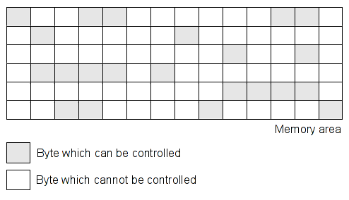
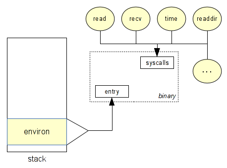
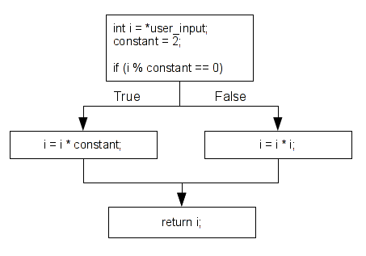
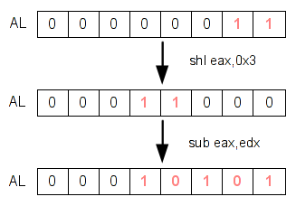

# 使用Pin进行污点分析与模式匹配


**作者：**[Jonathan Salwan](http://twitter.com/JonathanSalwan)
---

上周我在研究Pin的API，这篇文章作为我个人的思考笔记。这篇文章的所有例子都仅仅是个PoC，因此不是100%都可以运行。但是能给人灵感。

## 目录:
* [1 - 介绍](#1 - 介绍)
  * [1.1 - 概念](#1.1 - 概念)
  * [1.2 - 什么是污点](#1.2 - 什么是污点)
    * [1.2.1 - 动态分析](#1.2.1 - 动态分析)
    * [1.2.2 - 静态分析](#1.2.2 - 静态分析)
    * [1.2.3 - 动态还是静态?](#1.2.3 - 动态还是静态?)
  * [1.3 - 一些问题](#1.3 - 一些问题)
    * [1.3.1 - 字节还是比特?](#1.3.1 - 字节还是比特?)
* [2 - 简单的污染内存块](#2 - 简单的污染内存块)
  * [2.1 - 捕获系统调用](#2.1 - 捕获系统调用)
  * [2.2 - 捕获LOAD和STORE指令](#2.2 - 捕获LOAD和STORE指令)
  * [2.3 - 输出](#2.3 - 输出)
* [3 - 传播污点](#3 - 传播污点)
  * [3.1 - 需求]
  * [3.2 - 内存传播]
  * [3.3 - 寄存器传播]
  * [3.4 - 输出]
* [4 - 跟随你的数据]
  * [4.1 - 需求]
  * [4.2 - 输出]
* [5 - 检测UAF漏洞]
* [6 - 检测未检查指针的使用]
* [7 - 总结]


# 1 - 介绍
## 1.1 - 概念
污点分析是一种流行的方法，其包含了检查用户输入的变量哪些被修改过。所有用户输入如果没有经过正确的检查，都是危险的。使用污点分析方法去检查寄存器和内存区域哪些被用户控制了当程序崩溃时 - 这可能是有用的。



要知道一个区域是可读还是可写这是非常容易的。但是要去检查哪些区域是用户可控的和哪些区域被污点传播过了，这是非常困难的。比如，看下面代码:
```c
/* Example 1 */
void foo1(const char *av[])
{
  uint32_t a, b;

  a = atoi(av[1]);
  b = a;
  foo2(b);
}

/* Example 2 */
void foo2(const char *av[])
{
  uint8_t *buffer;

  if (!(buffer = (uint8_t *)malloc(32 * sizeof(uint8_t))))
    return(-ENOMEM);

  buffer[2]  = av[1][4];
  buffer[12] = av[1][8];
  buffer[30] = av[1][12];
}
```

在第一个例子中，一开始变量`a`和`b`并不是污点。当`atoi`函数被调用时，变量`a`被污染了。然后当变量`b`被分配了变量`a`的值后也被污染了。现在我们能知道`foo2`函数的两个参数都是用户可控的。

在第二个例子中，当`buffer`被`malloc`函数分配内存时并不是污点。之后，当被分配的区域被用户输入初始化时，我们需要污染`buffer+2`, `buffer+12`, `buffer+30`这3个字节。之后，当其中一个，两个或者所有字节被读时，我们可以得知读取这些字节的地方是用户可控的。

## 1.2 - 什么是污点
我们有两种可使用的方式，静态或动态分析。从这两种方式，我们能找到一些他们的优点和缺点。

### 1.2.1 - 动态分析
使用动态分析，基本上我们需要确定所有的用户输入，比如环境变量和系统调用。当我们遇到这些指令时，比如GET/PUT, LOAD/STORE，我们开始污染这些输入和传播或移除污点。



为了进行动态分析，我们需要一个动态二进制插桩框架(简称DBI)。DBI的目的是在每个指令间增加pre/post句柄。当一个句柄被调用时，你能够获取到所有你想知道的关于指令或环境(内存)的所有信息。

有一些工具提供一个叫中介码(IR)的数据结构。例如，[Valgrind](http://valgrind.org/)是一个受欢迎使用IR(Vex)的插桩框架。通常使用IR，每个变量都是处于静态单赋值形式([Static Single Assignment Form](http://en.wikipedia.org/wiki/Static_single_assignment_form))，这能更简单去标记污点和管理你的内存。下面有一个例子，是关于VEX和SSA form的，下面的代码是Vex用来代替`add eax, ebx`指令的替代表示。
```
t3 = GET:I32(0)     # get %eax, a 32-bit integer (t3 = eax)
t2 = GET:I32(12)    # get %ebx, a 32-bit integer (t2 = ebx) 
t1 = Add32(t3,t2)   # eger (t2 = ebx)
PUT(0) = t1         put %eax (eax = t1)
```

我选择使用[Pin](http://software.intel.com/en-us/articles/pin-a-dynamic-binary-instrumentation-tool)： 一个由Intel用C++开发的动态二进制插桩框架(不使用IR)。

### 1.2.2 - 静态分析
使用静态分析的优点是事实上，静态分析能比动态分析更好的覆盖代码。比如你下面看到的这例子，当代码被解析时，我们能提供一个上下文无关语法(CFG)和检测所有分支。



从另一方面来看，静态分析的主要缺点是它没动态分析准确 - 比如静态分析不能得到运行时的信息。我们不能获取到寄存器或内存的值。

### 1.2.3 - 动态还是静态?
正如你所看到的，每种方法都有各自的优缺点。如果你使用动态分析，我们就不能覆盖到所有的代码，但是结果是更可靠的。如果你使用静态分析，能覆盖到所有代码，但是却不能得到运行时的上下文信息。我选择使用动态分析，并讨论Pin的用法。也许在未来的博文中，我会提及到更多的静态分析 -- 静态分析是一种非常有趣的方法，并且我们能基于AST(Abstract Syntax Tree，抽象语法树)做许多非常棒的事。

## 1.3 - 一些问题
在研究动态分析时，我遇到了一些问题。我认为在进行污点分析时我们会发现许多有趣的问题。

### 1.3.1 - 字节还是比特?
其中一个问题是要确定什么方法能更准确的做一个大精度的污点标记。例如，当一个被控制的字节被乘并被储存到内存的某个地方，我们应该做什么？我们应该标记目标变量吗？看下面的代码:
```
; uint32_t num, x;
;
; x = atoi(av[1])
; if (x > 0 && x < 4)
;   num = 7 * x;
; return num;

400556:   call   400440 <atoi@plt>
40055b:   mov    edx,eax
40055d:   mov    eax,edx
40055f:   shl    eax,0x3
400562:   sub    eax,edx
400564:   mov    DWORD PTR [rbp-0x4],eax
400567:   mov    eax,DWORD PTR [rbp-0x4]
40056a:   leave  
40056b:   ret
```

在上面的代码中，我们仅仅只能控制变量`num`的5比特，而不是整个整型数据。所以，当这变量作为返回值返回时或在其他地方被使用时，我们不能说我们控制了这个变量的整体。



那么，该怎么办呢？是标记字节更容易，还是标记用户控制的比特更容易呢？如果你标记字节，这会更容易，但是数据不会100%可靠。如果我们标记字节，将会更困难，还有许多管理污点树的难点，但是这得到的数据是99%可靠的。这只是我们不得不解决的问题之一。

# 2 - 简单的污染内存块
在第一个例子中，我们将要染色`read`内存区域，然后我们将会看到Pin的API简要的概况。在第一个测试中，我们将会:
1. 捕获`sys_read`的系统调用
2. 获得污点区域的第二和第三个参数
3. 当有像`LOAD`和`STORE`这样的指令在污点区域时，调用句柄。

我们使用下面的代码进行测试，`foo`函数中简单的调用了`LOAD`和`STORE`指令
```
void foo(char *buf)
{
  char a;

  a = buf[0];
  a = buf[4];
  a = buf[8];
  a = buf[10];
  buf[5]  = 't';
  buf[10] = 'e';
  buf[20] = 's';
  buf[30] = 't';
}

int main(int ac, char **av)
{
  int fd;
  char *buf;

  if (!(buf = malloc(256)))
    return -1;

  fd = open("./file.txt", O_RDONLY);
  read(fd, buf, 256), close(fd);
  foo(buf);
}
```

## 2.1 - 捕获系统调用

## 2.2 - 捕获LOAD和STORE指令
## 2.3 - 输出
# 3 - 传播污点

暂时太监。。。因为发现使用的是C++.....